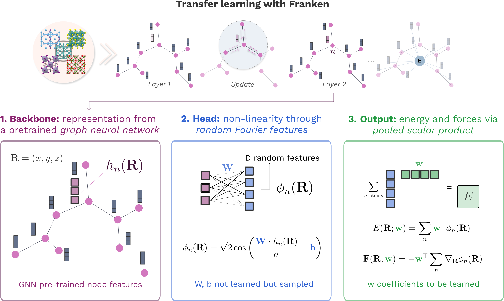

.. role:: frnkword

Franken: A Method for Efficient and Accurate Molecular Dynamics
================================================================

:tt:`franken` is a transfer learning method which leverages the representation learned from a pre-trained atomistic model and adapts it to new systems in extremely efficient way using scalable kernel techniques (Random Fourier Features). 
The method is described in the publication: `Fast and Fourier features for transfer learning of interatomic potentials, npj Computational Materials (2025) <https://doi.org/10.1038/s41524-025-01779-z>`_. 

Franken's ingredients
---------------------

:tt:`franken` operates through a three-step pipeline:

#. **Feature Extraction:** The initial step involves representing the chemical environment of each atom within a
   molecular configuration using features extracted from a pre-trained graph neural network (GNN) model such as the general purpose `MACE-MP0 <https://arxiv.org/abs/2401.00096>`_ or a custom one.

#. **Random Features:** In this stage, :tt:`franken` introduces non-linearity into the model by transforming the
   extracted GNN features using Random Features (RF) maps, which offer a computationally efficient alternative
   to traditional kernel methods.

#. **Energy and Force Prediction:** The final step involves predicting atomic energies and forces with a simple linear regression in the RF space, making the optimization process deterministic and efficient (minutes instead of hours or days).

   The three-step pipeline at the heart of :tt:`franken`.

Advantages of Franken
---------------------

- **Training efficiency:** :tt:`franken` detemines the globally optimal model
  parameters through a closed-form solution. This eliminates the reliance on iterative gradient descent, leading to
  substantial reductions in training time and ensuring efficient optimization.

- **Data efficiency:** By leveraging the information learned by a pre-trained model, :tt:`franken` achieves accurate results already with tens/hundreds of training samples.

- **Easy training:** :tt:`franken` is designed to be user-friendly, requiring only a few lines of code to train a model::

   franken.autotune \
   --train-path train.xyz --val-path val.xyz \
   --backbone=mace --mace.path-or-id "mace_mh/0" \
   --rf=ms-gaussian --ms-gaussian.num-rf 4096

See the :doc:`training tutorial <notebooks/training>` for a complete, executable
workflow.

.. toctree::
   :maxdepth: 2
   :caption: Getting Started:
   :hidden:

   Introduction <self>

   topics/intro_installation.md

.. toctree::
   :maxdepth: 2
   :caption: Training:
   :hidden:

   Training tutorial <notebooks/training>
   topics/training_backbones.md
   topics/training_random_features.md
   topics/training_metrics.md
   topics/training_multigpu.md
   topics/training_stress.md

.. toctree::
   :maxdepth: 2
   :caption: Deploy:
   :hidden:

   topics/interface_overview.md
   topics/interface_ase.md
   Tutorial: MD with ASE <notebooks/molecular_dynamics>
   topics/interface_mace_lammps.md
   topics/interface_metatomic.md
   topics/interface_torchsim.md

.. toctree::
   :maxdepth: 3
   :caption: API Reference:
   :hidden:

   reference/index
   reference/cli
